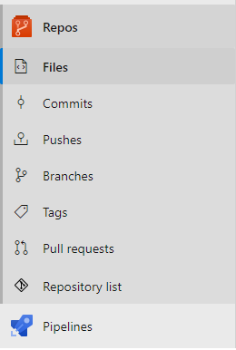

# Git repository list

This extension adds two new ways to view all the git repositories in your collection/organization.

1. All repositories that belongs to your collection/organization can be viewed from the new button on the collection/organization level.

2. All repositories that belongs to a certain project can be viewed from the new button under *Repos*.

**Only** repositories that the currently logged in user has access to will be shown!

## Privacy notice

No data is collected from this extension. Your data is your own.

## Release notes

### 1.0.13
- Bugfix: The size of empty repositories sometimes displayed NaN, will now display 0.00MB instead.
- Bugfix: The repository list inside the project was not sorted.
- Bugfix: The table of repos on the collection/organization level had a limit to amount of entries, this is now gone.
- Feature: When the size of a repo is larger than 1000MB, it is instead represented as GB.
- Minor changes to the discription of this extension.

### 1.0.14
- Changed name of the pivot element to "My repositories" on the organization/collection level to follow naming convention
- Added title with repository counter to the page