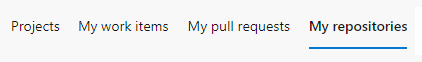
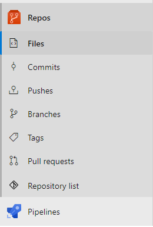

# Git repository list

This extension adds two new ways to view all the git repositories in your collection/organization.

1. All repositories that belong to your collection/organization can be viewed from the new button on the collection/organization level.

2. All repositories that belong to a certain project can be viewed from the new button under *Repos*.

**Only** repositories that the currently logged in user has access to will be shown!

## Filtering

Both views include a filter input at the top of the page. Type any part of a repository name to narrow the list instantly. Wildcard patterns using `*` are also supported — for example `auth*` to match names starting with "auth", or `*-service` to match names containing "-service". The counter next to the page title updates to show how many repositories are currently visible out of the total (e.g. `5 of 42`).

## Privacy notice

No data is collected from this extension. Your data is your own. For further details see our [privacy policy](https://github.com/CrazySolutions/AzDoExtensionGitList/blob/master/PRIVACY.md).

## Release notes

### 1.1.0

- Feature: Filter input added to both hubs. Plain-text typing does a case-insensitive substring match; patterns with `*` use glob-style matching. The count pill next to the title shows `5 of 42` while a filter is active.
- Feature: Sortable columns — click any column header to toggle between ascending and descending order.
- Dependency updates and major refactor of the source code

### 1.0.13
- Bugfix: The size of empty repositories sometimes displayed NaN, will now display 0.00MB instead.
- Bugfix: The repository list inside the project was not sorted.
- Bugfix: The table of repos on the collection/organization level had a limit to amount of entries, this is now gone.
- Feature: When the size of a repo is larger than 1000MB, it is instead represented as GB.
- Minor changes to the description of this extension.

### 1.0.14
- Changed name of the pivot element to "My repositories" on the organization/collection level to follow naming convention
- Added title with repository counter to the page